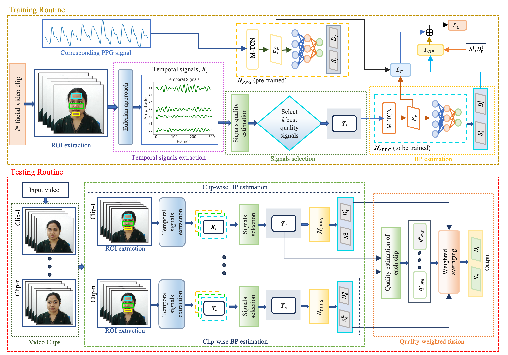

# BP-rPPG Dataset and ALIVE Baseline

**BP-rPPG: An Indian Face-Video Dataset and PPG-Guided Baseline for Remote Blood Pressure Estimation**

This repository provides instructions to access the BP-rPPG dataset and the implementation of the ALIVE baseline method.

## Baseline Method Overview

ALIVE uses two networks:

- `N_PPG`: a teacher network trained using 4-second contact PPG signals to estimate blood pressure.
- `N_rPPG`: a student network that estimates blood pressure from facial videos. During training, it learns with guidance from the PPG network.

During student training, the teacher network remains frozen. It extracts the PPG feature `F_p`, while the student network extracts the rPPG feature `F_r`. The student is trained using:

```text
L_C = L_F + L_DF
```

Here, `L_F` aligns the student and teacher features using negative Pearson correlation, while `L_DF` reduces the error between the predicted and ground-truth SBP and DBP values.

During testing, only the student network is used. The teacher network and contact PPG signals are not required. The clip-level BP predictions are combined using quality-weighted fusion to obtain the final BP estimate.

<p align="center">
  
</p>

## BP-rPPG dataset

BP-rPPG contains data from 305 participants. Each recording session includes:

- 90-second facial videos at 30 fps;
- synchronized contact PPG;
- reference SBP and DBP;
- an HQ recording and an LQ recording;
- two H.264 variants derived from LQ: C-23 and C-40.

### Dataset access

The dataset is available for approved non-commercial research and educational use.

1. Complete the dataset [usage agreement](https://drive.google.com/file/d/1oKjDxWOxaTu0M9S7ykNCKdAlz6bLGJsb/view?usp=sharing).
2. Email the signed agreement to `phd2201101014@iiti.ac.in` and `deeplearning@iiti.ac.in`.

Redistribution of the dataset or derived identifiable content is prohibited without permission from the authors.

## Installation

```bash
python -m venv .venv
source .venv/bin/activate
pip install -r requirements.txt
```

MATLAB 2023a or a compatible release is required for the supplied rPPG ROI and temporal-signal preprocessing code.

## Repository layout

```text
alive/
  mtcn.py                    M-TCN blocks
  models.py                  teacher and student architectures
  losses.py                  L_F and L_DF
  train_teacher.py           PPG teacher training
  train_student.py           PPG-guided ALIVE training
  test_student.py            rPPG-only testing and fusion
  data.py                    strict processed-data loaders and splits
  metrics.py                 MAE, ME, STD and quality fusion

preprocessing/
  python/
    prepare_ppg_dataset.py   4-second segmentation and cross-dataset resampling
    extract_landmarks.py     frame-wise MediaPipe landmarks
    merge_student_modalities.py
    validate_processed_data.py
  matlab/
    process_video.m
    define_face_rois.m
    extract_block_temporal_signals.m
    select_top_k_signals.m

configs/
  teacher.yaml
  student.yaml
  paper_settings.yaml
```

# Step 1: Prepare the PPG datasets

All PPG recordings from BP-rPPG, MIMIC-II, MSPM, or another permitted source must be converted into:

- non-overlapping 4-second clips;
- one common sampling frequency;

The repository default is **30 Hz**, producing `4 x 30 = 120` samples per clip. This matches the 30 fps rPPG clips and gives teacher/student feature representations of equal length.

## 1.1 Create a PPG manifest

Create `manifests/teacher_ppg.csv` with one row per source recording:

```csv
dataset,subject_id,video_id,signal_path,sampling_rate,sbp,dbp,signal_column
BP-rPPG,subject_001,subject_001,data/bp_rppg/subject_001_ppg.csv,100,120,80,0
MSPM,P001,hand_raise,data/mspm/P001_ppg.csv,256,118,77,PPG
MIMIC-II,record_0001,segment_01,data/mimic/record_0001.npy,125,132,84,0
```

Required columns:

```text
dataset, subject_id, signal_path, sampling_rate, sbp, dbp
```

Optional columns:

```text
video_id, signal_column, signal_key, delimiter, has_header,
skip_rows, start_sample, end_sample
```

Supported signal formats are CSV/TXT, NPY, NPZ and MAT. For NPZ or MAT files, provide `signal_key` when required.

## 1.2 Segment and resample

```bash
python preprocessing/python/prepare_ppg_dataset.py \
  --manifest manifests/teacher_ppg.csv \
  --output-root processed/teacher_ppg/4_sec \
  --clip-seconds 4 \
  --target-fs 30 \
  --nan-policy drop \
  --normalisation none
```

No signal normalization is imposed by default because the accepted manuscript does not specify one. The option can be changed to `zscore` or `minmax` when reproducing a separately recorded laboratory configuration.

Output:

```text
processed/teacher_ppg/4_sec/
  BP-rPPG/
    subject_001/
      ppg.csv          # N x 120
      labels.csv       # N x 2: SBP, DBP
      metadata.csv
  MSPM/
  MIMIC-II/
```

Validate before training:

```bash
python preprocessing/python/validate_processed_data.py teacher \
  --root processed/teacher_ppg/4_sec \
  --clip-samples 120
```

# Step 2: Train the PPG teacher

The paper pretrains `N_PPG` on the combined PPG data and then freezes it during ALIVE training.

```bash
python -m alive.train_teacher \
  --config configs/teacher.yaml \
  --data-root processed/teacher_ppg/4_sec \
  --out-dir runs/teacher
```

The script performs subject-level splitting within each contributing dataset and saves:

```text
runs/teacher/
  best_teacher.pt
  last_teacher.pt
  subject_split.json
  training_history.json
```

The teacher checkpoint is generated locally and is not supplied in the repository.

# Step 3: Prepare rPPG student inputs

## 3.1 Generate compressed video variants

```bash
bash scripts/compress_lq_to_c23_c40.sh \
  raw_videos/LQ raw_videos/C_23 raw_videos/C_40
```

The script uses H.264 with CRF 23 and CRF 40, following the paper.

## 3.2 Extract frame-wise landmarks

```bash
python preprocessing/python/extract_landmarks.py \
  --video raw_videos/HQ/subject_001.avi \
  --out landmarks/HQ/subject_001.csv
```

The output intentionally has no header so MATLAB row 1 corresponds to video frame 1.

## 3.3 Extract top-k temporal signals

From MATLAB:

```matlab
process_video(...
    'raw_videos/HQ/subject_001.avi', ...
    'landmarks/HQ/subject_001.csv', ...
    'processed/student/HQ/4_sec/subject_001', ...
    'BP-rPPG', 'subject_001', 'subject_001', 'HQ', ...
    120, 80, [20 20]);
```

The pipeline follows the paper:

1. divide each video into non-overlapping 4-second clips;
2. obtain MediaPipe-based forehead, cheek and chin ROIs;
3. divide the ROIs into non-overlapping blocks;
4. extract the average green-channel signal from each block;
5. compute the signal-quality score over 0.7-4 Hz with `w_n=3`;
6. retain the top `k=15` signals;
7. store the mean selected-signal quality for later fusion.

Output per subject:

```text
processed/student/HQ/4_sec/subject_001/
  rppg_topk.csv       # N x (15*120)
  clip_quality.csv    # N x 1
  labels.csv          # N x 2
  metadata.csv
```

The final incomplete portion of a video is discarded. For a 90-second recording, 22 complete 4-second clips are retained and the last 2 seconds are not used.

## 3.4 Match synchronized PPG clips

Prepare the BP-rPPG contact PPG using Step 1 with matching `dataset`, `subject_id`, `video_id`, and `clip_index`. Then merge it into each video-quality folder:

```bash
python preprocessing/python/merge_student_modalities.py \
  --student-root processed/student \
  --quality HQ \
  --ppg-root processed/teacher_ppg/4_sec
```

Repeat for `LQ`, `C_23`, and `C_40`. The script matches clips by metadata rather than silently assuming row order.

Validate the student training data:

```bash
python preprocessing/python/validate_processed_data.py student \
  --root processed/student \
  --quality HQ \
  --clip-seconds 4 \
  --fps 30 \
  --k-signals 15 \
  --require-ppg
```

# Step 4: Train the ALIVE student

```bash
python -m alive.train_student \
  --config configs/student.yaml \
  --teacher-checkpoint runs/teacher/best_teacher.pt \
  --data-root processed/student \
  --quality HQ \
  --out-dir runs/student/HQ
```

During training:

- each 4-second clip is an independent sample;
- `N_PPG` is loaded and frozen;
- `N_rPPG` receives the top 15 rPPG temporal signals;
- `F_r` is aligned with `F_p` using negative Pearson correlation;
- SBP and DBP are supervised using `L_DF`;
- Adam is used for up to 20 epochs, batch size 4, learning rate `1e-4`.

The subject split is approximately 80%/10%/10% and is saved for reproducibility.

# Step 5: Test the student only

Testing never loads the teacher and does not require contact PPG.

```bash
python -m alive.test_student \
  --config configs/student.yaml \
  --checkpoint runs/student/HQ/best_student.pt \
  --data-root processed/student \
  --quality HQ \
  --split-file runs/student/HQ/subject_split.json \
  --split-name test \
  --out-dir results/HQ
```

For every video, the script:

1. predicts SBP and DBP independently for every clip;
2. uses the mean quality of the clip's selected top-k signals as its weight;
3. computes the quality-weighted SBP and DBP;
4. reports MAE, ME and STD in mmHg.

Outputs:

```text
results/HQ/
  clip_predictions.csv
  video_predictions.csv
  metrics.json
```

# Paper-aligned architecture

Both networks use the released M-TCN implementation:

- input size `K x L` for the student and `1 x L` for the teacher;
- three causal convolutions per dilation block;
- five filters of size `1 x 3`;
- chomp, ReLU and dropout after each convolution;
- residual connection and downsampling projection;
- dilations `1, 2, 4, ..., 2^floor(log2(L))`;
- final `K x L` map projected to a `1 x L` feature representation;
- MLP prediction of SBP and DBP.

For four-second inputs at 30 Hz/fps, `L=120` and the dilation sequence is `1, 2, 4, 8, 16, 32, 64`.

Details that are not numerically stated in the manuscript are isolated in configuration files and documented in [Implementation notes](docs/IMPLEMENTATION_NOTES.md).

## Run repository tests

```bash
python -m pytest -q
```

## Citation

```bibtex
@article{saikia2026bprppg,
  title={BP-rPPG: An Indian Face-Video Dataset and PPG-Guided Baseline for Remote Blood Pressure Estimation},
  author={Saikia, Trishna and Gupta, Puneet and Liljeberg, Pasi},
  journal={IEEE Transactions on Consumer Electronics},
  note={Accepted for publication},
  year={2026}
}
```
